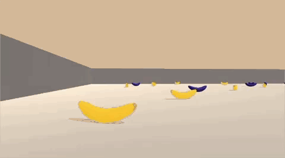

# Deep Q Network Banana Hunter
### Training a Deep Q Network to Collect Yellow Bananas



This project was completed as part of the Udacity [Deep Reinforcement Learning Nanodegree](https://www.udacity.com/course/deep-reinforcement-learning-nanodegree--nd893).

Code within this project is written from scratch (with some inspiration and tips taken from previous [DQN homework](https://github.com/udacity/deep-reinforcement-learning/tree/dc65050c8f47b365560a30a112fb84f762005c6b/dqn) in the Udacity program).

## Environment
The goal is to train an agent through (Deep) Q-Learning that is capable of navigating a world containing yellow and blue bananas. Yellow bananas result in a reward of +1, and blue bananas -1. The task is episodic, with the episode ending after a fixed amount of time. An agent that "solves" the environment is defined as achieving a reward of +13 or greater on average over 100 episodes.

The environment is provided by Udacity, and based on Unity's [ML-Agents](https://github.com/Unity-Technologies/ml-agents) framework.

Observations are delivered in the form of 37-dimensional floating point vectors, and include measurements such as the velocity of the agent. The actions available to the agent are `0` (walk forwards), `1` (walk backwards), `2` (turn left), and `3` (turn right).

## Setup
### Code Setup
Based on the Udacity setup (see [here](https://github.com/udacity/deep-reinforcement-learning/tree/55474449a112fa72323f484c4b7a498c8dc84be1#dependencies)),
Conda/virtualenv can be used to install the required dependencies. For example:
```bash
virtualenv --python=python3 venv
source venv/bin/activate
pip install -r requirements.txt
```

### Environment Setup
To get the environment executable, follow the Udacity instructions listed [here](https://github.com/udacity/deep-reinforcement-learning/tree/062b0a421663e90ef8171c6da849c52e4b16623d/p1_navigation).

## Project Structure
### `dqn.py`
This contains the core code for training the DQN agent.

### `models/checkpoint.pth`
A pre-trained model that can be loaded into an Agent.

### `Report.ipynb`
This contains an example of how to train an agent on the environment and visualize it after training.

### `scripts/launch_jupyter.sh`
Script to launch Jupyter with the `dqn.py` module on `PYTHONPATH`.

## Training/Running the Agent
The `dqn.py` modules provides classes/helper functions to train an agent. Take a look at `Report.ipynb`
for an example of how to do this.

## References
1. Mnih, Volodymyr, Koray Kavukcuoglu, David Silver, Andrei A. Rusu, Joel Veness, Marc G. Bellemare, Alex Graves, 
Martin A. Riedmiller, Andreas K. Fidjeland, Georg Ostrovski, Stig Petersen, Charles Beattie, Amir Sadik, Ioannis 
Antonoglou, Helen. King, Dharshan Kumaran, Daan Wierstra, Shane Legg and Demis Hassabis. “[Human-level control through 
deep reinforcement learning](https://www.nature.com/articles/nature14236).” Nature 518 (2015): 529-533.
